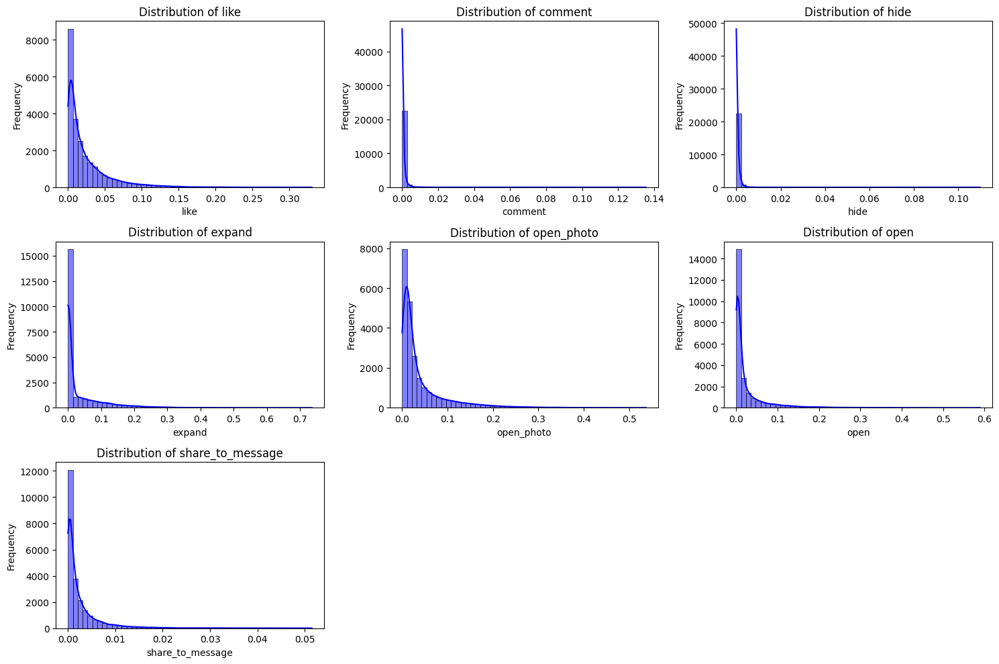

# Тестовое задание на VK-LAB (осень 2024)

Почему выбрал задание с рекомендательной системой? — задача показалась самой знакомой среди остальных (я не был готов погружаться полностью в звуковые данные за неделю, а для LLM я боялся, что не хватит времени выполнить задание) 

## Рекомендательная система

> График распределений конверсий просмотров в разные активности

### Выбор целевой переменной

Из графиков распределения активностей видно, что большинство конверсий можно просто оценить нулём: для активностей comment, hide, open, expand, share_to_message таргет более 12000 объектов равен примерно 0. Из оставшихся двух вариантов я выбрал предсказывание конверсии просмотра в открытие фотографии поста в полный размер — по сравнению с конверсией в лайки чуть пошире спектр значений и мне казалось, что определить, понравится ли случайный пост, будет сложнее.

### Что имеется?

Картинки и тексты разных размеров и зачастую никак не связанных друг с другом (как, например, с "Подслушано у полиции" - небольшим баннером в ширину и фотографией двух девушек с подписью "&#128571;").

Для всех моделей я преобразовал картинки в общий размер 224x224, что в среднем визуально не сильно повлияло на выборку.

Для всех моделей я брал в качестве максимального количества токенов - 512, как для классического BERT'а, потому что зачем ещё больше я не представляю.

### Попытка использовать самое сильное

Сначала хотелось попробовать просто запустить самую крутую CNN'ку — <a href="https://arxiv.org/abs/2201.03545">ConvNeXt</a>. Результат — очень грустный, модель выдавала константый ответ даже при взвешенной функции потерь, где я умножал значение лосса на объекте на $exp(\alpha * label)$, то есть для кросс-энтропии получается $-exp(\alpha * y)(ylogp + (1-y)log(1-p))$.

### Попытка использовать модель поменьше

После ConvNeXt я решил взять что-нибудь попроще — <a href="https://arxiv.org/abs/1905.11946">EfficientNet</a> и обучить его на том же, на чём и ConvNeXt. Модель стала обучаться и выдавать что-то похожее не на константу. Лучшая модель, как мне кажется, это модель, обученная на взвешенной кросс-энтропии (см. выше) с $\alpha = 2$. По метрикам это выглядит не так (есть модели, обученные на MSE или BCE), но на глаз кажется, что модель всё таки чаще замечает редкие объекты и больше "понимает распределение" в целом.

> Таблица с графиками распределений предсказаний свёрточных нейронных сетей можете увидеть ниже; голубым цветом обозначено распределение истинных таргетов, синим — распределение предсказаний модели.

### Совмещение текста и картинок

Раз просто ConvNeXt не сработал, попробуем что-нибудь найти из ConvNeXt + <a href="https://arxiv.org/abs/1810.04805">BERT'а</a> :)

> Таблица с графиками распределений предсказаний ConvNeXt + BERT можете увидеть ниже; голубым цветом обозначено распределение истинных таргетов, синим — распределение предсказаний модели

### Пример предсказания ConvNeXt+Bert и EfficientNet

- 0.0655, 0.1038, 0.0163, 0.0339, 0.0104, 0.0590, 0.0634, 0.0267 - inference EfficientNet
- 0.0150, 0.0979, 0.0056, 0.0073, 0.0052, 0.0192, 0.0097, 0.0151 - inference ConvNeXt + BERT
- 0.0246, 0.1006, 0.0141, 0.0100, 0.0052, 0.0202, 0.0571, 0.0021 - Ground truth

> Тексты последовательно

1. Прекрасные женщинв
2. nan
3. Сочетание цветов
4. Сегодня во всем мире состоится премьера второго сезона телесериала &quot;Дом Дракона&quot;. Помните такой? Про Вестерос и Таргариенов, предыстория знаменитой &quot;Игры престолов&quot;.   Чем не повод вспомнить наших дракончиков, которые есть у нас в ассортименте? &#128513; Правда они у нас не такие кровожадные как в сериале &#128521;  Смотрите &quot;Дом Дракона&quot;? Смотрели &quot;Игру престолов&quot;? &#128009;
5. Какую книгу Вы сейчас читаете?
6. Проникновенная поделка со смыслом &#128330;
7. В этот день в 1948 году родился 3-кратный чемпион мира по мотокроссу в классе 250сс, победитель «Мотокросса Наций» и «Трофея Наций» в составе сборной СССР, 8-кратный чемпион СССР Геннадий Анатольевич Моисеев. Светлая память&#33;    #RacingMemory #MXGP #KTMMotorsport
8. &#129414;Это казанский парк Урицкого

> Фотографии постов

### В чём главная проблема (imho)

Данные вообще не простые — 25000 постов, но большинство из них имеет таргет, который можно оценить средним (и 
это будет чуть ли не лучшая оценка по logloss'у), тексты у постов тоже абсолютно разные и могут быть вообще бессмысленными (как тот пост с двумя девушками).

Для таких выборок хочется сделать oversampling, для картинок даже недавно сделали <a href="https://www.sciencedirect.com/science/article/pii/S0957417424009849">это</a>, но после разных попыток использовать несколько автоэнкодеров или просто методы сэмплирования из коробки, практически все спотыкались о слишком маленькую скорость работы (как SMOTER, ждать его не было времени). Поэтому я обошёлся только функциями потерь с весами.

### Выводы

Наверное, есть какое-то идейное решение, которое лучше пройдёт по всем метрикам, я попытался найти какие-то популярные модели и среди них найти подходящую. И, как мне кажется, комбинация ConvNeXt и BERT'а хоть и не часто находит "аномальные" посты, но в среднем выдаёт приличный результат - LogLoss = 0.14

### По коду

- В [exploration](recsys/exploration.ipynb) — код для простейшего понимания, что находится в датасете.
- В [common_stuff](recsys/common_stuff.py) находится код, который приходилось несколько раз использовать (сделано для удобства).
- В [pics_only_effnet](recsys/pics_only_effnet.ipynb) — обучение EfficientNet на различных функциях потерь.
- В [pics_only_convnext](recsys/pics_only_convnext.ipynb) — обучение ConvNeXt на различных функциях потерь.
- В [convnext_bert](recsys/convnext_bert.ipynb) — обучение ConvNeXt на различных функциях потерь.
- В [ae_usage](recsys/ae_usage.ipynb) — попытки использовать автоэнкодеры для генерации новых данных (oversampling'а).
- В [visualizing_models](recsys/visualizing_models.ipynb) — код для визуализации работы моделей на датасете.
- В [pictures](recsys/pictures) — директория с картинками, использованными в задании.